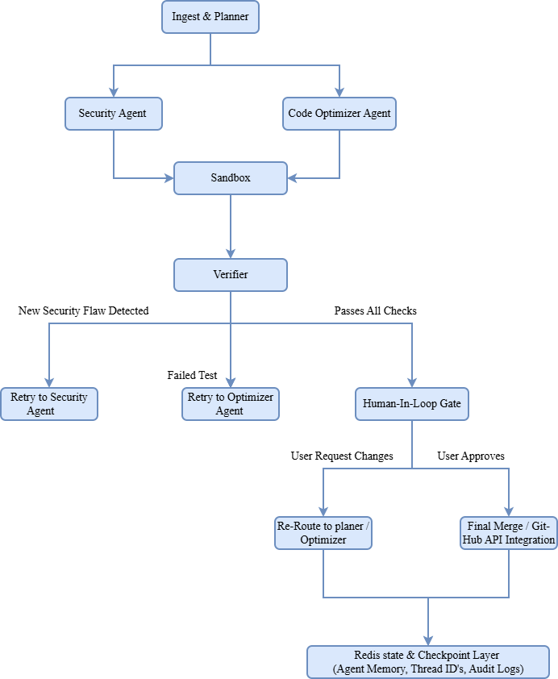

# Autonomous Multi-Agent AI Security Auditor And Code Optimizer
Think of this project as a smart AI assistant for your code.

When you give it a GitHub repository, a team of specialized AI agents scans your code for security bugs, fixes inefficient code, tests the changes in a safe sandbox, and opens a Pull Request on GitHub for you to review and merge.

## System Architecture & Workflow



* **Ingest Phase (`ingest.py`):** Fetches repository code and structures source files into memory.
* **Security Audit (`agents/security_agent.py` & `agents/security_critic.py`):** Scans code for vulnerability patterns, validates severity ratings, and aggregates security reports using robust Pydantic schemas.
* **Optimization & Verification (`agents/optimizer_agent.py` & `agents/optimizerAgent_verifier.py`):** Proposes performance refactoring and runs tests in an isolated sandbox (`sandbox.py`) to confirm zero regressions.
* **Human-in-the-Loop Gate (`agents/human_in_loop.py` & `human_review_pr.py`):** Manages session state via Redis checkpointing (`redis_checkpointer.py`), allowing humans to review, approve, or request changes.
* **GitHub Automated Deployment (`human_review_pr.py`):** Creates target branches, commits verified patches via PyGithub, and opens Pull Requests automatically.

---

## Project Structure

```text
multi_agent_engine/
├── agents/
│   ├── human_in_loop.py           # Human-in-the-loop review decision routing
│   ├── optimizer_agent.py         # Code optimization and refactoring agent
│   ├── optimizerAgent_verifier.py # Refactoring output validator
│   ├── security_agent.py          # Vulnerability scanning agent
│   └── security_critic.py         # Secondary validation critic for audit reports
├── api.py                         # FastAPI REST endpoints & Swagger interface
├── app.py                         # LangGraph state graph & pipeline orchestrator
├── human_review_pr.py             # PyGithub service & PR creation gateway
├── ingest.py                      # Repository parser and file reader
├── redis_checkpointer.py          # Redis state management & session persistence
├── sandbox.py                     # Isolated test & code execution engine
├── schemas.py                     # Pydantic schemas (AliasChoices validation)
├── verifier.py                    # Verification logic for proposed patches
├── docker-compose.yml             # Docker service orchestration (API + Redis)
├── Dockerfile                     # Multi-stage Python container build
├── .dockerignore                  # Docker context exclusion rules
└── requirements.txt               # Project dependencies
```

---

##  Getting Started

### Prerequisites
* Docker Desktop installed and running
* Git installed
* Groq API Key and GitHub Personal Access Token

### Environment Setup
Create a `.env` file in the root directory:

```env
GROQ_API_KEY=your_groq_api_key_here
GITHUB_TOKEN=your_github_token_here
REDIS_HOST=redis
REDIS_PORT=6379
```
---

## Quick Start with Docker Compose

1. **Spin up services:**
   ```bash
   docker compose up --build -d
   ```
2. **Check container status:**
   ```bash
   docker compose ps
   ```
3. **Access Interactive API Docs:**
   Open [http://localhost:8000/docs](http://localhost:8000/docs) in your browser.
4. **Stop services:**
   ```bash
   docker compose down
   ```

---

##  Local Development (Without Docker)
1. **Install dependencies:**
   ```bash
   pip install -r requirements.txt
   ```
2. **Run local Redis server:**
   Ensure Redis is active on `localhost:6380`
3. **Start API server:**
   ```bash
   python api.py
   ```

---

## API Usage

### Trigger Audit Pipeline
* **Endpoint:** `POST /api/v1/audit/start`
* **Payload:**
  ```json
  {
    "repo_url": "https://github.com/owner/repository"
  }
  ```

### Review / Approve Audit Session
* **Endpoint:** `POST /api/v1/review`

* **Payload (Inspect session):**
  ```json
  {
    "audit_id": "audit-c5c1ef53",
    "action": "review"
  }
  ```

* **Payload (Approve & Open GitHub PR):**
  ```json
  {
    "audit_id": "audit-c5c1ef53",
    "action": "approve"
  }
  ```


